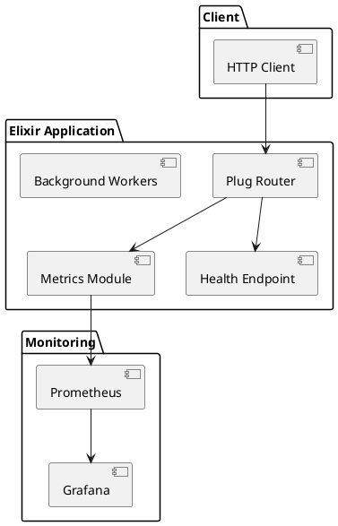
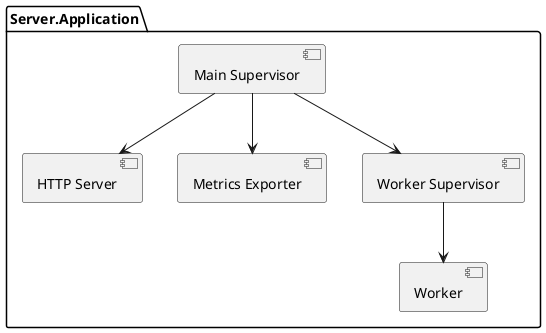
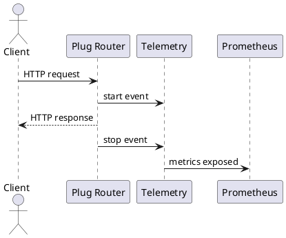
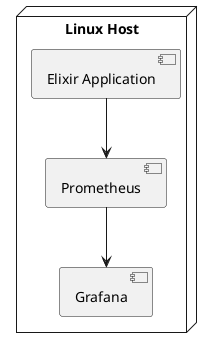

# Elixir Monitoring Server

An **open-source, production-oriented Elixir HTTP server** focused on **reliability, observability, and clean system design**.
The project demonstrates how to combine **OTP supervision**, **Telemetry**, **Prometheus**, and **Grafana** to build a fault-tolerant and monitorable backend service.

This repository is suitable for:

* Learning Elixir/OTP in a realistic setting
* Studying system monitoring and observability
* Open-source contribution and extension
* Portfolio or academic use

---

## Features

* HTTP server using Plug + Cowboy
* OTP supervision trees for fault tolerance
* Application and request metrics via Telemetry
* Prometheus-compatible `/metrics` endpoint
* Grafana-ready metrics
* Health check endpoint
* Modular and extensible architecture

---

## High-Level Architecture

```
Client ──HTTP──▶ Plug Router ──▶ OTP Supervision Tree
                          │
                          ├── Telemetry Events
                          │        │
                          ▼        ▼
                     /metrics   Prometheus ──▶ Grafana
```

---

## UML Diagrams (PlantUML)

The following diagrams are provided in PlantUML format to allow easy rendering and modification by contributors.

---

### Component Diagram



---

### OTP Supervision Tree



---

### Request and Metrics Flow



---

### Deployment Diagram



---

## Project Structure

```text
elixir_monitoring_server/
├── lib/
│   ├── server/
│   │   ├── application.ex    # Supervision tree
│   │   ├── router.ex         # HTTP routing
│   │   ├── metrics.ex        # Telemetry metrics
│   │   ├── health.ex         # Health checks
│   │   └── worker.ex         # Background workers
│   └── server.ex
├── config/
├── priv/
├── test/
└── mix.exs
```

---

## Getting Started

### Requirements

* Elixir 1.15 or newer
* Erlang/OTP 26 or newer
* Prometheus
* Grafana

---

### Setup

```bash
mix deps.get
mix compile
```

---

### Running the Server

```bash
mix run --no-halt
```

Default address:

```
http://localhost:4000
```

---

## Available Endpoints

| Endpoint   | Purpose              |
| ---------- | -------------------- |
| `/`        | Root endpoint        |
| `/health`  | Service health check |
| `/metrics` | Prometheus metrics   |

---

## Prometheus Configuration

```yaml
scrape_configs:
  - job_name: "elixir_monitoring_server"
    static_configs:
      - targets: ["localhost:4000"]
```

---

## Grafana Usage

* Add Prometheus as a data source
* Build dashboards using metrics such as request rate, latency, and error counts

Example query:

```promql
rate(http_request_count[1m])
```

---

## Reliability and Design Principles

* OTP supervisors automatically restart failed processes
* Isolation between HTTP handling and background workers
* Metrics collection is non-blocking
* Designed for long-running services

---

## Open Source and Contributions

This project is intended to be **fully open source**.

Contributions are welcome in the form of:

* Additional metrics
* Improved dashboards
* Documentation enhancements
* Distributed monitoring support
* Alerting and automation

---

## License

MIT License

---

## Maintainer

DarynOngera

---

This project emphasizes **clarity, correctness, and real-world backend practices** rather than framework-specific abstractions.
